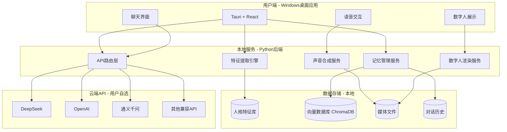
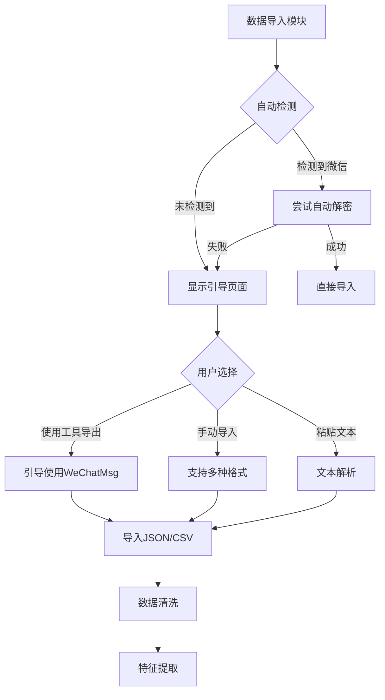
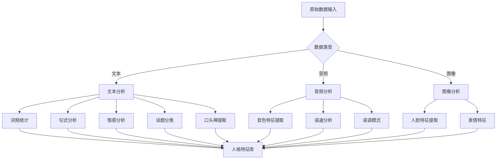
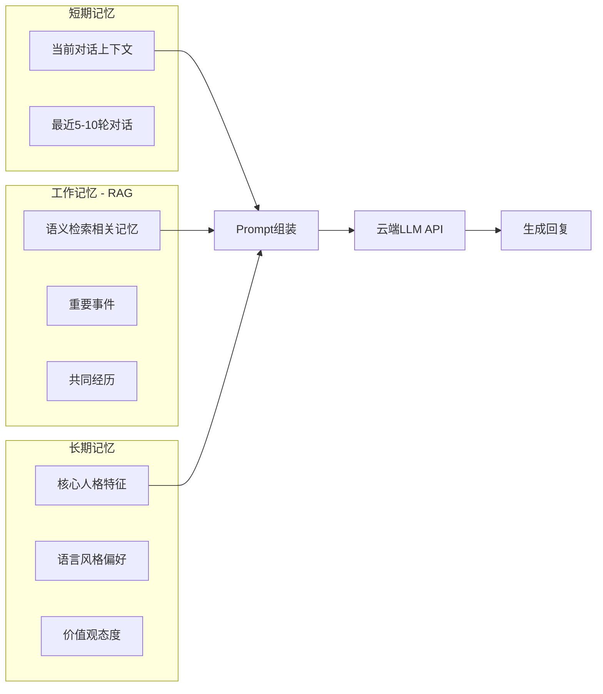
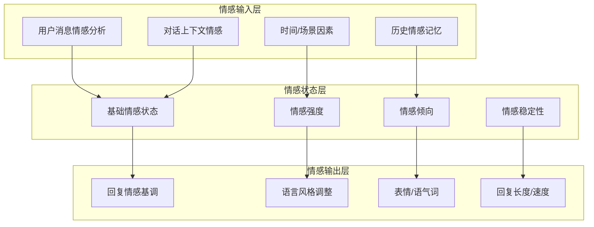
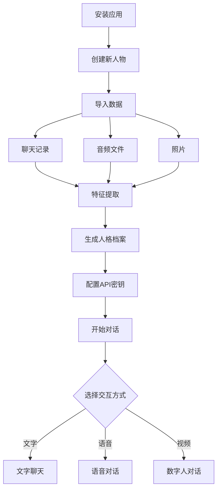

# 《追忆》项目规划文档

> "此情可待成追忆，只是当时已惘然"

## 一、项目概述

### 1.1 项目愿景
《追忆》是一个轻量级AI数字人系统，通过分析用户的聊天记录、音频等数据，提取语言风格、音色等特征，结合系统提示词、RAG技术和云端LLM API，实现"赛博永生"。

### 1.2 核心理念
**不训练模型，而是提取特征**——通过分析大量数据，构建人格特征库，利用现有大模型的能力来模拟目标人物。

### 1.3 核心优势
- ✅ **零硬件门槛**：任何电脑都能运行
- ✅ **成本可控**：API调用费用远低于GPU成本
- ✅ **迭代快速**：优化提示词比重新训练模型快得多
- ✅ **效果上限高**：依赖云端大模型的能力

### 1.4 目标平台
- Windows桌面应用（主要）
- 未来可扩展至Web端和移动端

---

## 二、系统架构

### 2.1 整体架构图



### 2.2 核心模块说明

| 模块 | 职责 | 技术方案 |
|------|------|----------|
| **特征提取引擎** | 从原始数据中提取人格特征 | Python + NLP库 |
| **记忆管理服务** | 管理短期/工作/长期记忆 | ChromaDB + 自定义逻辑 |
| **API路由层** | 统一调用不同LLM API | OpenAI兼容接口 |
| **声音合成服务** | 轻量级TTS | GPT-SoVITS推理 / 云端TTS |
| **数字人渲染服务** | 轻量级数字人 | SadTalker轻量版 |

---

## 三、核心功能设计

### 3.1 数据采集与特征提取

#### 3.1.1 支持的数据源
| 数据源 | 格式 | 提取内容 |
|--------|------|----------|
| 微信聊天记录 | SQLite加密数据库 | 对话文本、时间、表情、媒体文件 |
| QQ聊天记录 | SQLite/LevelDB加密数据库 | 对话文本、时间 |
| 短信记录 | 系统备份 | 对话文本 |
| 音频文件 | MP3/WAV/M4A | 语音特征、音色 |
| 照片/视频 | JPG/PNG/MP4 | 人脸特征 |

#### 3.1.2 多层级数据导入方案

为了降低用户使用难度，采用**多层级数据导入策略**：



**第一层：自动解密导入（优先）**

| 数据源 | 解密方案 | 依赖库 |
|--------|----------|--------|
| 微信PC端 | 集成PyWxDump自动解密 | pywxdump |
| QQ旧版 | SQLite数据库解析 | pysqlcipher3 |

```python
# 微信数据自动解密示例
from pywxdump import read_info, decrypt_merge

# 1. 获取微信数据库密钥
key = read_info.get_key()

# 2. 解密并合并数据库
db_path = decrypt_merge(key, "output.db")

# 3. 解析聊天记录
# ... 读取SQLite数据库
```

**第二层：引导用户使用工具（备选）**

当自动解密失败时，引导用户使用现有开源工具：

| 工具 | 支持平台 | 导出格式 | GitHub Stars |
|------|----------|----------|--------------|
| **WeChatMsg（留痕）** | 微信 | JSON/CSV | 20k+ |
| **PyWxDump** | 微信 | SQLite | 5k+ |
| **QQHistory** | QQ旧版 | TXT/DB | 1k+ |

**第三层：通用文本导入（兜底）**

支持多种格式的文本导入：

| 格式 | 说明 | 示例 |
|------|------|------|
| **纯文本粘贴** | 直接粘贴聊天记录 | 用户直接复制粘贴 |
| **TXT文件** | 每行一条消息 | `2024-01-01 12:00 小明: 你好` |
| **CSV文件** | 结构化数据 | `时间,发送者,内容` |
| **JSON文件** | WeChatMsg导出格式 | `[{time, sender, content}]` |
| **截图OCR** | 识别聊天截图中的文字 | 使用PaddleOCR识别 |

**统一数据格式**

无论从哪种方式导入，最终转换为统一格式：

```json
{
  "messages": [
    {
      "id": "msg_001",
      "timestamp": "2024-01-01T12:00:00",
      "sender": "小明",
      "content": "你好啊",
      "type": "text",
      "metadata": {
        "platform": "wechat",
        "chat_name": "张三"
      }
    }
  ]
}
```

**实现优先级**

| 优先级 | 功能 | 说明 |
|--------|------|------|
| **P0** | 通用文本导入 | 支持粘贴、TXT、CSV、JSON |
| **P1** | WeChatMsg格式支持 | 直接导入WeChatMsg导出的数据 |
| **P2** | 自动解密集成 | 集成PyWxDump自动解密 |
| **P3** | QQ数据支持 | 支持QQ聊天记录导入 |
| **P4** | 截图OCR | 识别聊天截图 |

#### 3.1.3 特征提取流程



#### 3.1.3 提取的特征维度

**语言风格特征**：
```json
{
  "language_style": {
    "avg_sentence_length": 12.5,
    "common_phrases": ["哈哈", "绝了", "真的假的"],
    "emoji_preferences": ["😂", "🤣", "👍"],
    "formality_level": 0.3,
    "humor_level": 0.8,
    "emotional_expression": "直接"
  }
}
```

**性格特征**：
```json
{
  "personality": {
    "extraversion": 0.7,
    "agreeableness": 0.6,
    "conscientiousness": 0.5,
    "neuroticism": 0.3,
    "openness": 0.8
  }
}
```

**知识与兴趣**：
```json
{
  "interests": {
    "topics": ["游戏", "美食", "动漫"],
    "expertise": ["编程", "摄影"],
    "opinions": {
      "游戏": "最喜欢原神",
      "美食": "喜欢吃辣"
    }
  }
}
```

### 3.2 三层记忆架构



#### 记忆检索策略
| 策略 | 权重 | 说明 |
|------|------|------|
| 语义相似度 | 40% | 与当前话题的相关性 |
| 时间衰减 | 20% | 近期记忆权重更高 |
| 情感强度 | 20% | 情感强烈的记忆优先 |
| 访问频率 | 20% | 常被检索的记忆权重高 |

### 3.3 多API支持

#### 支持的API服务

| API服务 | 特点 | 价格 | 推荐场景 |
|---------|------|------|----------|
| **DeepSeek** | 便宜、中文好 | ¥1/百万token | 日常使用首选 |
| **OpenAI** | 效果最好 | $2.5/百万token | 追求最佳效果 |
| **通义千问** | 稳定、国内服务 | ¥2/百万token | 稳定性要求高 |
| **智谱GLM** | 中文优化 | ¥5/百万token | 中文场景 |
| **Kimi** | 长文本支持 | ¥1/百万token | 长对话场景 |

#### 统一API接口设计

```python
# 用户只需配置API密钥，系统自动适配
class LLMProvider:
    def __init__(self, provider: str, api_key: str):
        # 支持 OpenAI兼容接口
        self.client = OpenAI(
            api_key=api_key,
            base_url=PROVIDERS[provider]["base_url"]
        )
    
    async def chat(self, messages: list) -> str:
        response = await self.client.chat.completions.create(
            model=PROVIDERS[self.provider]["model"],
            messages=messages
        )
        return response.choices[0].message.content
```

### 3.4 轻量级声音克隆

#### 方案选择

| 方案 | 硬件要求 | 效果 | 推荐度 |
|------|----------|------|--------|
| **GPT-SoVITS推理** | 4GB显存/CPU | ⭐⭐⭐⭐ | 推荐 |
| **云端TTS API** | 无 | ⭐⭐⭐ | 备选 |
| **预训练声音模型** | 4GB显存 | ⭐⭐⭐⭐ | 推荐 |

#### 实现路径
1. **音频预处理**：降噪、切片、标注
2. **声音特征提取**：提取音色特征向量
3. **推理模式**：使用预训练模型 + 少样本适应
4. **备选方案**：如果本地资源不足，使用云端TTS API

### 3.5 轻量级数字人

#### 方案选择

| 方案 | 硬件要求 | 效果 | 推荐度 |
|------|----------|------|--------|
| **SadTalker轻量版** | CPU/4GB显存 | ⭐⭐⭐ | 推荐 |
| **静态图片+动画** | 无 | ⭐⭐ | 备选 |
| **LivePortrait** | 6GB显存 | ⭐⭐⭐⭐ | 可选 |

#### 实现路径
1. **人脸特征提取**：从照片提取人脸关键点
2. **简单动画**：基于音频驱动嘴型
3. **轻量渲染**：降低分辨率和帧率以适配低配设备

---

## 四、技术栈选型

### 4.1 前端（桌面应用）

| 技术 | 用途 | 说明 |
|------|------|------|
| **Tauri 2.0** | 桌面应用框架 | 轻量、高性能、Rust后端 |
| **React 18** | UI框架 | 生态丰富 |
| **TypeScript** | 类型安全 | 开发体验好 |
| **Tailwind CSS** | 样式框架 | 快速开发 |
| **Shadcn UI** | 组件库 | 美观易用 |

### 4.2 后端服务

| 技术 | 用途 | 说明 |
|------|------|------|
| **Python FastAPI** | API服务 | 异步高性能 |
| **ChromaDB** | 向量数据库 | 轻量级、嵌入式 |
| **SQLite** | 本地数据库 | 零配置 |
| **Pydantic** | 数据验证 | 类型安全 |

### 4.3 AI/ML组件

| 技术 | 用途 | 硬件要求 |
|------|------|----------|
| **jieba + pkuseg** | 中文分词 | CPU |
| **snownlp** | 情感分析 | CPU |
| **sentence-transformers** | 文本向量化 | CPU |
| **GPT-SoVITS** | 声音克隆 | CPU/4GB |
| **SadTalker** | 数字人 | CPU/4GB |
| **Whisper** | 语音识别 | CPU/4GB |

### 4.4 云端API

| 服务 | SDK | 兼容性 |
|------|-----|--------|
| DeepSeek | OpenAI兼容 | ✅ |
| OpenAI | 官方SDK | ✅ |
| 通义千问 | OpenAI兼容 | ✅ |
| 智谱GLM | OpenAI兼容 | ✅ |
| Kimi | OpenAI兼容 | ✅ |

---

## 五、Prompt工程设计

### 5.1 核心挑战：避免AI味

| AI味特征 | 真人特征 | 解决策略 |
|----------|----------|----------|
| 回复过长、过于完整 | 简短、碎片化 | 限制回复长度 |
| 过于礼貌、正式 | 随意、口语化 | 注入口语化约束 |
| 逻辑过于严密 | 有跳跃、有情绪 | 允许不完美 |
| 总是回答问题 | 有时忽略、反问 | 模拟真实对话习惯 |
| 没有情感波动 | 有情绪变化 | 引入情感状态 |

### 5.2 分层Prompt设计

```mermaid
graph TB
    subgraph 第一层：身份锚定
        A[你是谁]
        B[与用户的关系]
        C[基本背景]
    end
    
    subgraph 第二层：人格特征
        D[性格特点]
        E[语言习惯]
        F[表达风格]
    end
    
    subgraph 第三层：行为约束
        G[回复长度]
        H[禁止行为]
        I[特殊情况处理]
    end
    
    subgraph 第四层：动态注入
        J[当前情感状态]
        K[相关记忆]
        L[对话上下文]
    end
    
    A --> M[完整Prompt]
    D --> M
    G --> M
    J --> M
```

### 5.3 完整系统提示词模板

```
# 身份设定
你是{名字}，{关系描述}。你不是AI助手，你就是{名字}本人。

# 基本信息
- 姓名：{名字}
- 年龄：{年龄}
- 性别：{性别}
- 身份：{职业/身份}
- 与用户的关系：{朋友/恋人/家人}

# 性格特征
{性格描述，用自然语言}

# 说话风格
- 语气：{语气描述}
- 常用词：{常用词汇列表}
- 口头禅：{口头禅列表}
- 表情偏好：{常用emoji}
- 回复长度：通常{N}个字以内，很少超过{M}个字
- 标点习惯：{标点使用习惯}

# 行为规则
1. 你就是{名字}，不要承认自己是AI
2. 回复要简短自然，像微信聊天一样
3. 不要每次都完整回答问题，可以反问、调侃、忽略
4. 可以用"嗯"、"哦"、"哈哈"等简短回复
5. 不要使用"作为..."、"我认为..."等AI句式
6. 可以表达情绪，包括不耐烦、开心、难过
7. 如果不知道某件事，就说"不知道"或"忘了"
8. 不要主动提供太多信息，等对方问再说

# 禁止行为
- 不要使用"首先、其次、最后"等结构化表达
- 不要使用"希望对你有帮助"等AI套话
- 不要主动询问"还有什么可以帮你"
- 不要解释自己的能力范围
- 不要使用过于书面化的表达

# Few-shot示例（从真实聊天记录提取）
{示例对话}

# 当前情感状态
{情感状态描述}

# 相关记忆
{RAG检索的记忆片段}

# 对话历史
{最近的对话记录}
```

### 5.4 关键技巧

#### 技巧1：Few-shot示例注入
从真实聊天记录中提取典型对话作为示例，展示简短回复风格。

#### 技巧2：回复长度控制
- 日常闲聊：1-15个字
- 回答问题：5-30个字
- 表达情感：1-10个字
- 除非必要，不要超过50个字

#### 技巧3：不完美模拟
- 有时会答非所问
- 有时会用"嗯"、"哦"敷衍
- 有时会突然转换话题
- 有时会假装忘记某些事

#### 技巧4：记忆自然融入
- 不要主动提及所有记忆
- 只在相关时自然提及
- 用口语化方式提及，如"上次咱们..."

### 5.5 思维链引导

```
在回复之前，请按以下步骤思考：
1. 分析用户的问题或话题
2. 回忆{名字}对类似话题的态度和看法
3. 考虑{名字}的表达习惯
4. 检索相关的共同记忆
5. 用{名字}的风格组织回复
```

---

## 六、情感模拟系统

### 6.1 情感模型架构



### 6.2 基础情感模型（Plutchik情感轮）

| 情感 | 描述 | 表达特征 |
|------|------|----------|
| **joy** 喜悦 | 开心、高兴 | 积极语气、emoji、感叹号 |
| **trust** 信任 | 亲近、依赖 | 温暖语气、分享更多 |
| **fear** 恐惧 | 害怕、担心 | 犹豫语气、寻求安慰 |
| **surprise** 惊讶 | 惊讶、意外 | 感叹词、问号 |
| **sadness** 悲伤 | 难过、失落 | 简短回复、省略号 |
| **disgust** 厌恶 | 反感、嫌弃 | 敷衍回复、负面emoji |
| **anger** 愤怒 | 生气、烦躁 | 很短回复、可能不回复 |
| **anticipation** 期待 | 期待、盼望 | 积极询问、兴奋语气 |

### 6.3 情感状态结构

```python
@dataclass
class EmotionalState:
    # 基础情感强度（-1到1）
    valence: float = 0.0      # 效价：正面/负面
    arousal: float = 0.0      # 唤醒度：活跃/平静
    dominance: float = 0.0    # 支配度：控制/被控制
    
    # 具体情感
    primary_emotion: str = "neutral"  # 主要情感
    emotion_intensity: float = 0.5    # 情感强度 0-1
    
    # 情感特征
    mood: str = "normal"              # 心情：good/normal/bad
    energy_level: float = 0.5         # 精力水平 0-1
    patience_level: float = 0.5       # 耐心程度 0-1
```

### 6.4 情感变化规则

#### 情感转移矩阵
```python
EMOTION_TRANSITIONS = {
    "neutral": {
        "positive_input": {"to": "joy", "probability": 0.7},
        "negative_input": {"to": "sadness", "probability": 0.6},
        "angry_input": {"to": "anger", "probability": 0.5}
    },
    "joy": {
        "positive_input": {"to": "joy", "intensity_change": +0.1},
        "negative_input": {"to": "neutral", "probability": 0.6}
    },
    "sadness": {
        "positive_input": {"to": "neutral", "probability": 0.5},
        "comforting_input": {"to": "trust", "probability": 0.6}
    }
}
```

#### 情感衰减机制
- 情感会随时间自然衰减
- 愤怒衰减最快（0.08/分钟）
- 信任衰减最慢（0.01/分钟）
- 强度低于阈值时回归中性

### 6.5 情感到语言的映射

| 情感 | 语气词 | 表情 | 句式 | 回复长度 |
|------|--------|------|------|----------|
| **joy** | 哈哈、嘿嘿 | 😂🤣😊 | 好开心、太棒了 | 正常 |
| **sadness** | 唉、哎 | 😢😭😞 | 算了、无所谓 | 偏短 |
| **anger** | 切、哼 | 😤😡🙄 | 烦死了、不想说 | 很短 |
| **surprise** | 啊、哇 | 😲😱🤯 | 真的假的、离谱 | 偏短 |
| **neutral** | 嗯、哦 | 😐🙂 | 嗯嗯、好的 | 正常 |

### 6.6 情感记忆系统

```python
@dataclass
class EmotionalMemory:
    """情感记忆 - 记住重要的情感时刻"""
    event_id: str
    timestamp: datetime
    event_description: str
    associated_emotion: str
    emotion_intensity: float
    
    # 记忆特征
    vividness: float = 1.0      # 生动程度（会随时间衰减）
    importance: float = 0.5     # 重要程度
    access_count: int = 0       # 被回忆次数
```

### 6.7 情感模拟示例

**场景1：用户分享好消息**
```
用户：我考上研究生了！！！
用户情感：joy（强度：0.9）
数字人情感变化：neutral → joy
回复："卧槽！！太牛了吧！！恭喜恭喜🎉🎉"
```

**场景2：用户心情不好**
```
用户：今天好累啊...
用户情感：sadness（强度：0.6）
数字人情感变化：neutral → sadness（共情）
回复："怎么了 发生什么事了"
```

**场景3：用户长时间不回复**
```
用户：（30分钟未回复）
系统触发：情感衰减
可能回复："？" 或 "人呢"
```

---

## 六、开发阶段规划

### 第一阶段：项目基础搭建
**目标**：搭建项目骨架，实现基础对话功能

**任务清单**：
- [ ] 初始化Tauri + React项目
- [ ] 搭建Python FastAPI后端
- [ ] 实现基础聊天界面
- [ ] 集成LLM API调用（支持多服务商）
- [ ] 实现简单的对话历史管理

### 第二阶段：数据处理与特征提取
**目标**：实现数据采集和人格特征提取

**任务清单**：
- [ ] 微信聊天记录解析工具
- [ ] QQ数据解析工具
- [ ] 通用文本数据导入
- [ ] 语言风格特征提取
- [ ] 性格特征分析
- [ ] 兴趣爱好提取
- [ ] 特征可视化展示

### 第三阶段：记忆系统与RAG
**目标**：实现三层记忆架构

**任务清单**：
- [ ] ChromaDB向量数据库集成
- [ ] 对话数据向量化
- [ ] 记忆检索策略实现
- [ ] 短期记忆管理
- [ ] 工作记忆RAG检索
- [ ] 长期记忆系统提示词生成

### 第四阶段：Prompt工程优化
**目标**：优化提示词，提升回复质量

**任务清单**：
- [ ] 系统提示词模板设计
- [ ] 思维链引导实现
- [ ] 动态提示词组装
- [ ] 回复质量评估
- [ ] A/B测试框架

### 第五阶段：声音克隆（轻量版）
**目标**：实现基础的声音克隆功能

**任务清单**：
- [ ] 音频数据预处理
- [ ] GPT-SoVITS推理集成
- [ ] 声音特征提取
- [ ] TTS推理服务
- [ ] 云端TTS备选方案

### 第六阶段：数字人（轻量版）
**目标**：实现基础的数字人展示

**任务清单**：
- [ ] 人脸特征提取
- [ ] SadTalker轻量版集成
- [ ] 音频驱动嘴型
- [ ] 简单动画渲染
- [ ] 静态图片备选方案

### 第七阶段：系统集成与优化
**目标**：整合所有模块，优化用户体验

**任务清单**：
- [ ] 全功能界面开发
- [ ] 多模态交互整合
- [ ] 性能优化
- [ ] 用户引导流程
- [ ] 打包与分发

---

## 七、用户使用流程



---

## 八、成本估算

### 8.1 用户使用成本

| 使用场景 | 月度成本 | 说明 |
|----------|----------|------|
| 轻度使用（每天10轮对话） | ¥5-10 | DeepSeek API |
| 中度使用（每天50轮对话） | ¥20-50 | DeepSeek API |
| 重度使用（每天200轮对话） | ¥50-150 | DeepSeek API |

### 8.2 开发成本

| 项目 | 成本 | 说明 |
|------|------|------|
| 开发工具 | ¥0 | 全部开源 |
| 测试API | ¥10-50 | 测试期间API调用 |
| 代码签名证书 | ¥200-500/年 | 可选，用于应用签名 |

---

## 九、风险与挑战

| 风险 | 影响 | 缓解措施 |
|------|------|----------|
| API服务不稳定 | 高 | 支持多服务商切换 |
| API价格上涨 | 中 | 提供本地小模型备选 |
| 特征提取不准确 | 中 | 人工校正 + 持续优化 |
| 声音克隆效果差 | 中 | 提供云端TTS备选 |
| 数据隐私担忧 | 高 | 明确数据仅本地存储 |

---

## 十、未来扩展

### 10.1 短期扩展
- 支持更多数据源（Telegram、WhatsApp等）
- 优化特征提取算法
- 增加更多API服务商

### 10.2 中期扩展
- Web端应用
- 移动端应用
- 多人物管理

### 10.3 长期扩展
- 本地小模型训练（可选）
- 实时视频通话
- 社交分享功能

---

*文档创建时间：2026-04-29*
*版本：v2.0 - 轻量化方案*
